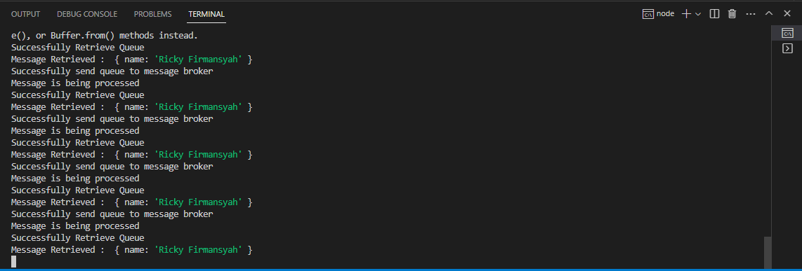

# mongo-redis-rabbitmq
Implementasi Message Broker
# node_schedule
Latihan MessageBroker di Node JS

Installasi depedensi
```bash
npm install
```

Run program
```
nodemon app
```

###Endpoint
http://localhost:5000/queue

Screenshot
#### Screenshoot Output
Output Node

